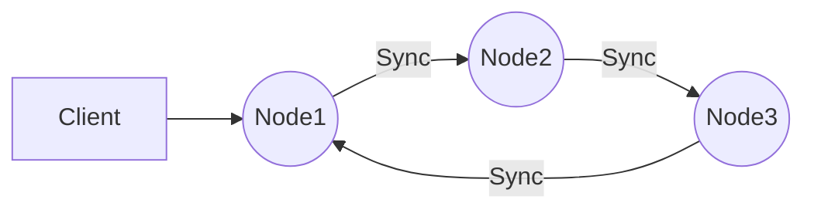

# Anytype node
To build and run the Anytype Node on your own server, follow these technical steps:

1.  Clone the Anytype Node repository to your local machine.
2.  Navigate to the root directory of the repository, where you will find a `Makefile`.
3.  Run the command `make deps` to install the required dependencies for the Anytype Node.*
4.  Run the command `make build` to build the Anytype Node.*
5.  If there are no errors, the Anytype Node will be built and can be found in the `/bin` directory.

*To avoid any Go language version incompatibility issues, please use version `1.19` of Go.

When running the Anytype Node, you can use the following options:

 - `-c` Every node should be run with the configuration file option. By
   default, the option flag is set to `etc/any-sync-node.yml.` You can
   always generate a new configuration using the appropriate command **???**
 -   `-v` This option shows the current version of the Anytype Node and then exits.
 -   `-h` This option shows the help message and then exits.

## Graph example of using anytype nodes group

