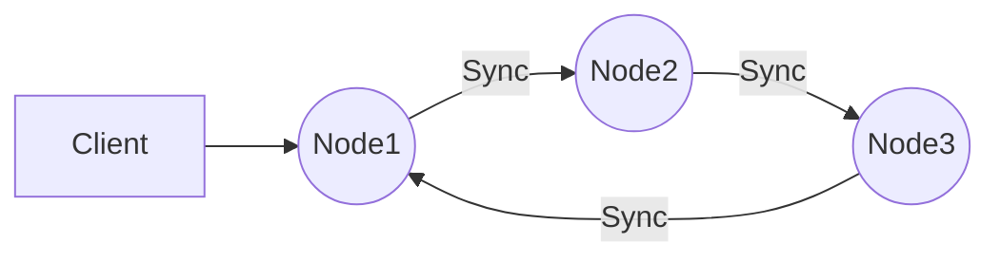

# Any-Sync Node
Implementation of node from [`any-sync`](https://github.com/anyproto/any-sync) protocol.

## Building the source
To ensure compatibility, please use Go version `1.21`.

To build and run the Any-Sync Node on your own server, follow these steps:

1.  Clone `any-sync-node` repository.
2.  Navigate to the root directory of the repository.
3.  Run the following commands to install the required dependencies and build the Any-Sync Node.
    ```
    make deps
    make build
    ```
4.  If there are no errors, the Any-Sync Node will be built and can be found in the `/bin` directory.

## Running
Any-Sync Node requires a configuration. You can generate configuration files for your nodes with [`any-sync-network`](https://github.com/anyproto/any-sync-tools) tool.

The following options are available for running the Any-Sync Node:

 - `-c` — path to config file (default `etc/any-sync-node.yml`). 
 - `-v` — current version.
 - `-h` — help message.

## Graph example of using Any-Sync Nodes group



## Contribution
Thank you for your desire to develop Anytype together!

❤️ This project and everyone involved in it is governed by the [Code of Conduct](https://github.com/anyproto/.github/blob/main/docs/CODE_OF_CONDUCT.md).

🧑‍💻 Check out our [contributing guide](https://github.com/anyproto/.github/blob/main/docs/CONTRIBUTING.md) to learn about asking questions, creating issues, or submitting pull requests.

🫢 For security findings, please email [security@anytype.io](mailto:security@anytype.io) and refer to our [security guide](https://github.com/anyproto/.github/blob/main/docs/SECURITY.md) for more information.

🤝 Follow us on [Github](https://github.com/anyproto) and join the [Contributors Community](https://github.com/orgs/anyproto/discussions).

---
Made by Any — a Swiss association 🇨🇭

Licensed under [MIT License](./LICENSE).
