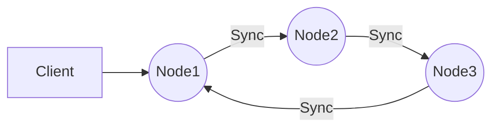

# Any-Sync Node
Implementation of node from [`any-sync`](https://github.com/anyproto/any-sync) protocol.

## Building the source
To build and run the Any-Sync Node on your own server, follow these technical steps:

1.  Clone the Any-Sync Node repository to your local machine.
2.  Navigate to the root directory of the repository, where you will find a `Makefile`.
3.  Run the command `make deps` to install the required dependencies for the Any-Sync Node.*
4.  Run the command `make build` to build the Any-Sync Node.*
5.  If there are no errors, the Any-Sync Node will be built and can be found in the `/bin` directory.

*To avoid any Go language version incompatibility issues, please use version `1.19` of Go.

## Running
When running the Any-Sync Node, you can use the following options:

 - `-c` Every node should be run with the configuration file option. By
   default, the option flag is set to `etc/any-sync-node.yml.` You can
   always generate a new configuration using the appropriate command **???**
 -   `-v` This option shows the current version of the Any-Sync Node and then exits.
 -   `-h` This option shows the help message and then exits.

## Graph example of using Any-Sync Nodes group

## Contribution
Thank you for your desire to develop Anytype together. 

Currently, we're not ready to accept PRs, but we will in the nearest future.

Follow us on [Github](https://github.com/anyproto) and join the [Contributors Community](https://github.com/orgs/anyproto/discussions).

---
Made by Any — a Swiss association 🇨🇭

Licensed under [MIT License](./LICENSE).
